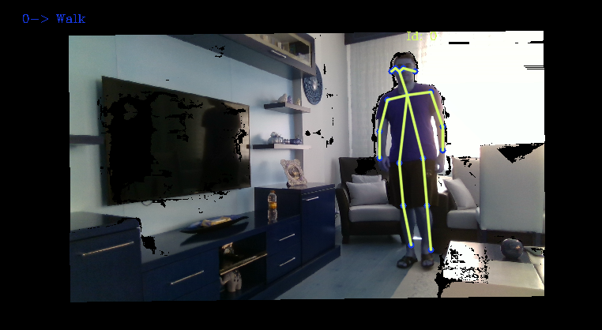

# ROBSEN ACTIVITY RECOGNITION PROJECT

## REQUIREMENTS

- Intel Real Sense 2.0 SDK (also OpenCV 3.4.1 is required but it is already present in Real Sense SDK)
- Cubemos SDK
- **Clang**, can be accessed from `https://clang.llvm.org/`
- **GNU Make**, can be accessed from `http://gnuwin32.sourceforge.net/packages/make.htm`
- **Python 3.7** (maybe 3.8 is also supported but did not try yet)

## ENVIRONMENT

- Project is supported currently only on Windows 10. For linux versions, some changes on the code has to be applied.

## CONTENTS

- This repository currently has 2 different projects inside: **Extract_Data** and **IRS_Detect**. Each of these projects include a seperate **makefile** and **main.cpp**. Other than these 2 projects, there is also a **Base** folder, which includes base classes that are inherited by the projects. 

### Extract Data:

This project is being used to read already-existing KARD and Kinect Datasets and to create csv folder that includes all the frames and all skeleton joints in these frames. From the **main.cpp** file, a single image/video or a combination of visual data can be selected to be processed. 

### IRS Detect:

With this project, an already existing **.bag** video file or real-time visual data taken from Intel Realsense D435i Camera is processed, skeletons of the people in the frames are extracted (up to 5 different people at the same time) and an activity recognition model is run. In this project, there are 2 different Models implemented for action recognition (DD_Model and MTLN_Model) but MTLN_Model does not work in real-time. Thus, DD_Model is selected by default. You can change this selection by changing `selected_model` parameter in **channel.py**. To run MTLN_Model, its weights also have to be downloaded and the download link is in `MTLN_Model > stored_models > info.txt`.  An example of the activity recognition can be found below:

## INSTRUCTIONS

- First of all, check if clang is added to the path by running `clang --version` on the command prompt. If not, then add **<clang_installation_folder>/bin** folder to the **PATH**.
- Check if GNU Make is added to the path by running `make --version` on the command prompt. If not, then add **<gnu_make_installation_folder>/bin** folder to the **PATH**.
- Open **Makefile** file in the project selected to be run and check if the paths for **PY_PATH**, **IRS_PATH** and **CM_PATH** are set correctly. If default locations are selected during the installation of Intel Real Sense SDK 2.0 and Cubemos SDK, then **IRS_PATH** and **CM_PATH** are probably correct. However, **PY_PATH** is probably wrong. Therefore, it should be set in the correct path.
- In the **main.cpp** file of the selected project, some parameters are declared by default. Please take a look at these and change them according to your processes. 

### RUNNING THE PROJECT

- Select which project to run and go to its directory.
- From the command propmt in the project directory, please execute `make -i`.